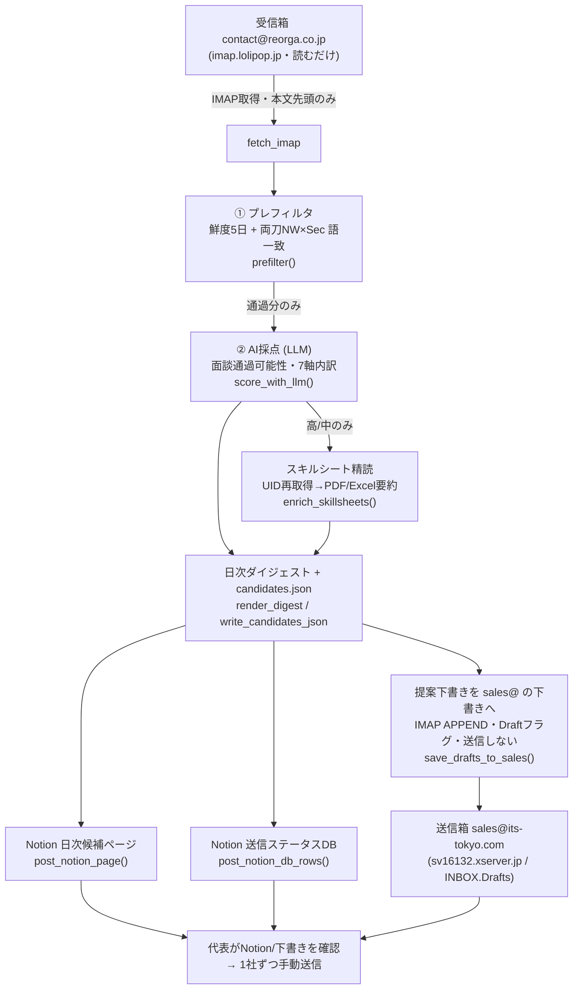

# SES自動マッチング 引き継ぎ・設計書（HANDOVER）

**この1ファイルだけで、担当が変わっても・別のAIセッションでも・携帯が壊れても、システムを完全に理解し復元できる**ことを目的にした正本。

- 版：v1.0（2026-07-13）
- 対象システム：`automation/ses-matching/`（SES 案件×要員 自動マッチング）
- 位置づけ：`README.md`＝使い方の手順書／`STATUS.md`＝稼働状況メモ／**本書＝設計と復旧の正本**。
- 上位方針：`../../CLAUDE.md`（Phase 0＝安定化優先）、営業の型：`../../skills/ses-sales/SKILL.md`。

> 🔑 **最重要の心構え**：コードとドキュメントは全部 GitHub（クラウド）にあるので、**携帯・PCが壊れても失われない**。
> 失われて困るのは「**GitHub Secrets の値**（パスワード・APIキー）」だけ。これらは意図的にリポジトリに保存していない。
> だから復旧で本当に必要なのは「**どのSecretが要るか／その値をどこから再取得するか**」の知識であり、それを §6・§7 に全部書いた。

---

## 1. システムは何をするか（30秒サマリー）

配信メール（REOorGA等）で毎日流れてくる **SES案件と要員** を自動で取り込み、**「面談通過の可能性」で採点**し、
マッチした要員へ送る **提案メールの下書きを sales@ の下書きフォルダに自動投入**する。同時に **Notionに候補一覧と送信ステータスDB** を作る。

**やること（自動）**：収集 → 絞り込み → 採点 → 下書き生成 → Notion反映 → sales@下書き保存。
**やらないこと（人間＝代表）**：要員の最終確認と **メール送信**。**送信は絶対に自動化しない**（スパム判定・商流毀損・ソース露見を避けるため）。

毎朝 **7:00 JST狙い**（8:30までに手元へ揃うようバッファ）に GitHub Actions が全自動実行。代表は Notion か sales@ の下書きを見て、良ければ1社ずつ手で送るだけ。

---

## 2. 設計思想（なぜこの形か）

| 原則 | 理由 |
|---|---|
| **受信と送信のアカウント完全分離** | REOorGA配信の活用を相手に露見させない。受信＝`contact@reorga.co.jp`（読むだけ）、送信＝`sales@its-tokyo.com`。**受信アドレスからは絶対に送信しない**。 |
| **送信は必ず人手** | 配信への自動返信はスパム・商流毀損リスク。AIは下書きまで。 |
| **2段採点でコスト最小化** | まず安いテキスト（件名＋要約）でプレフィルタ＆採点し、**高/中になった要員だけ**添付スキルシート(PDF/Excel)を読む。重い添付を無駄読みしない。 |
| **決定論の回帰テスト（eval gate）を毎回通す** | LLMは非決定的。プレフィルタ・下書き・宛先抽出・DB行生成などロジック部分は決定論テストで固め、壊れたらCIで止める。 |
| **個人情報はリポジトリに残さない** | スキルシート原本・候補JSON・ダイジェストは `.gitignore`。Notionと成果物(artifact)にのみ出す。 |
| **いつでも戻せる** | 安定版を `backup/*` ブランチに固定（§8）。タグはこの環境でpush不可のためブランチで代替。 |

---

## 3. アーキテクチャ（データフロー）



**処理順（`main()`）**：IMAP取込 → プレフィルタ → LLM採点 → スキルシート精読 → ダイジェスト/JSON出力 →
`post_notion_page`（try保護）→ `post_notion_db_rows`（try保護）→ `save_drafts_to_sales`（try保護）。
後段3つは互いに try で隔離され、**片方が失敗しても他は動く**。ダイジェスト/JSONは先に保存済みなので中核成果は常に残る。

---

## 4. コンポーネント早見表（`run_ses_matching.py` 71KB・単一ファイル）

| 区分 | 関数 | 役割 |
|---|---|---|
| 設定 | `_env` | 環境変数の取得（既定値つき）。全設定の入口。 |
| 受信 | `fetch_imap` / `fetch_full_by_uids` | REOorGAをIMAP取得（軽量→高/中のみUID再取得で精読）。timeout付き。 |
| 本文 | `_decode` / `_body_text` | 文字コード・本文抽出（不正charsetもフォールバック）。 |
| ① | `prefilter` / `_kw_hit` / `_kw_pattern` | 鮮度5日＋両刀NW×Secの語境界一致（`soc`∈associate等の誤爆を防止）。 |
| ② | `score_with_llm` / `_score_chunk` / `_call_llm` | LLM採点（バッチ・7軸内訳・型正規化・例外隔離）。 |
| スキル | `extract_skillsheets` / `summarize_skillsheet` / `enrich_skillsheets` | 高/中の要員のみ添付を読み要約。 |
| 下書き | `reply_parts` / `finalize_draft` / `build_draft_message` | テンプレ＋案件MAIL-BLOCK＋署名で決定論生成。件名 `Re:○○_ITS村山`。 |
| 宛先 | `extract_contact` / `backfill_contacts` / `_is_sendable_addr` | To自動抽出。reorga/noreply/曖昧は「要・宛先確認」に倒す。 |
| 安全網 | `validate_draft` | From違反・REOorGA混入・署名欠落を検知（送信前ガード）。 |
| 重複 | `_its_key` / `_dupe_key` / `flag_duplicates` / `load_proposed` | 同一(案件×要員)の二重提案を防止。 |
| 保存 | `save_drafts_to_sales` / `_detect_drafts_folder` | sales@ の下書きへ IMAP APPEND（`\Draft`・**送信しない**）。接続リトライ・in-memory重複排除・スコア降順。 |
| Notion | `notion_upload_file` / `post_notion_page` / `_notion_blocks_from_result` | 日次スナップショット＋スキルシート原本アップロード。返信本文は載せない。 |
| Notion DB | `ensure_notion_db` / `post_notion_db_rows` / `_db_row_props` / `_db_has_key` | 送信ステータスDB（未送信/送信済/見送り）。重複行を作らない（in-memory＋Notionクエリ）。 |
| 出力 | `render_digest` / `write_digest` / `write_candidates_json` | ダイジェスト.md と candidates JSON（gitignore）。 |

**周辺スクリプト**：
- `make_draft.py`：チャットで「〔案件〕×〔イニシャル〕出して」→ 送信可能な下書き1件を確定生成（共通エンジンを再利用）。
- `eval/run_eval.py`：決定論の回帰テスト一式（`--stage all`）。CIのeval gateで毎回実行。

**設定・素材ファイル**：`案件_YYYYMMDD_○○.md`（案件定義＋MAIL-BLOCK）、`reply-template.txt`（本文テンプレ）、
`signature.md`（村山署名の正本）、`scoring.md`（採点ルーブリック）、`sources.md`（取り込みルール）。

---

## 5. インフラ・アカウント台帳

| 用途 | アカウント | サーバ / ID | 契約元 | 備考 |
|---|---|---|---|---|
| 受信（読むだけ） | `contact@reorga.co.jp` | `imap.lolipop.jp` / 993 / SSL | ロリポップ | REOorGA配信のソース。**送信禁止**。 |
| 送信・下書き | `sales@its-tokyo.com` | `sv16132.xserver.jp` / 993 / SSL | エックスサーバー | 下書きフォルダ `INBOX.Drafts`。提案の唯一の送信元。 |
| 採点AI | OpenAI | model `gpt-4o-mini` | OpenAI Platform | Anthropic `claude-sonnet-4-6` でも可（どちらか一方）。 |
| Notion 親ページ | ITS-OS | `38244f16641f80d49a45cfae344184ea` | Notion | 配下に日次候補ページを自動作成。 |
| Notion DB | SES提案トラッカー | `39b44f16-641f-8127-abf5-fa44f8ffe335` | Notion | 送信ステータス管理（§9）。 |
| 実行基盤（全採点=安全網） | GitHub Actions | `.github/workflows/ses-matching.yml` | GitHub | cron `0 22 * * *` UTC＝**7:00 JST狙い**（遅延を見込み8:30着を狙うバッファ）。5日窓を全採点。手動実行可。 |
| 実行基盤（配信即マッチ=ポーリング） | GitHub Actions | `.github/workflows/ses-matching-poll.yml` | GitHub | cron `*/30 22-23,0-11 * * *` UTC＝**JST7:00–20:30を30分毎**。`--incremental`で新着だけ採点。ウォーターマーク(`digests/imap-watermark.txt`)を`actions/cache`で保持。手動実行可。 |
| コード本体 | GitHubリポジトリ | `ktakahashi7755-creator/its-company-os` | GitHub | 既定ブランチ `claude/focused-bell-kt8d7o`。 |

> ID（Notionページ/DBのid）は秘密ではないので本書に記載してよい。**秘密は「トークン・パスワード・APIキーの値」だけ**で、
> それらは GitHub Secrets にのみ保存し、本書にもコードにも書かない。

---

## 6. Secrets / Variables 完全レジストリ（★復元の要）

GitHub → リポジトリ → **Settings → Secrets and variables → Actions** で登録する。
**Secret＝秘密の値**（マスクされる）／**Variable＝非秘密の設定値**。

### 6.1 Secrets（値は秘密・要再取得）

| キー | 用途 | 値の再取得元（携帯が壊れても、ここから取り直せる） |
|---|---|---|
| `OPENAI_API_KEY` | AI採点 | platform.openai.com → API keys で新規発行 |
| `IMAP_HOST` | 受信サーバ名 | 値は `imap.lolipop.jp`（ロリポップのメール設定に記載） |
| `IMAP_PASSWORD` | `contact@reorga.co.jp` のパスワード | ロリポップ管理画面 → メール → 該当アドレスで確認/再設定 |
| `SALES_IMAP_HOST` | 送信箱の受信サーバ名 | 値は `sv16132.xserver.jp`（エックスサーバーのメール設定に記載） |
| `SALES_IMAP_PASSWORD` | `sales@its-tokyo.com` のパスワード | エックスサーバー管理画面 → メールアカウント設定で確認/再設定 |
| `NOTION_TOKEN` | Notion連携トークン | notion.so/my-integrations → 該当インテグレーション → Internal Integration Secret |
| `NOTION_PAGE_ID` | 親ページID | 値は `38244f16641f80d49a45cfae344184ea`（NotionページURL末尾のid） |
| `NOTION_DB_ID` | 送信ステータスDBのID（任意・固定用） | 値は `39b44f16-641f-8127-abf5-fa44f8ffe335`。未登録でも自動検索/再作成するが、**登録推奨**（重複DB防止＆安定） |
| `ANTHROPIC_API_KEY` | 採点（OpenAIを使わない場合のみ） | console.anthropic.com → API keys |

### 6.2 Variables（非秘密・省略可＝既定値で動く）

| キー | 既定値 | 用途 |
|---|---|---|
| `OPENAI_MODEL` | `gpt-4o-mini` | 採点モデル |
| `LLM_PROVIDER` | 自動 | `openai`/`anthropic` を明示したい時 |
| `IMAP_USER` | `contact@reorga.co.jp` | 受信ユーザー |
| `IMAP_PORT` / `IMAP_FOLDER` | `993` / `INBOX` | 受信ポート・フォルダ |
| `FRESH_DAYS` | `5` | 鮮度（配信何日以内を対象にするか） |
| `MAX_FETCH` / `MSG_BYTES` / `STAGE2_MAX` | `2500` / `40000` / `300` | 取得上限・1通バイト・採点上限 |
| `SALES_FROM` / `SALES_IMAP_USER` | `sales@its-tokyo.com` | 送信元 |
| `SALES_IMAP_PORT` | `993` | 送信箱ポート |
| `SALES_DRAFTS_FOLDER` | `Drafts`（**実運用は `INBOX.Drafts`**） | 下書きフォルダ名 |
| `SALES_IMAP_RETRIES` / `SALES_IMAP_TIMEOUT` | `3` / `30` | 接続リトライ・タイムアウト（Xserver間欠対策） |

> **採点キーは OpenAI か Anthropic のどちらか一方でよい**（`OPENAI_API_KEY` があればOpenAIを既定採用）。

---

## 7. 🚨 復旧ランブック（携帯・PCが壊れた／ゼロから作り直す場合）

**前提**：コードとドキュメントは GitHub にあるので消えない。復旧＝「実行環境に鍵を戻す」作業。

### 手順（上から順に）
1. **GitHubにログインできるPC/端末を用意**（別端末でよい。GitHubアカウントの2FA復旧が最優先）。
2. リポジトリ `ktakahashi7755-creator/its-company-os` を開く。コードは既に全部そこにある。
3. **Secrets を §6.1 に従って全部登録し直す**（値の取得元も§6.1に記載）。
   - メールのパスワードはロリポップ／エックスサーバーの管理画面で確認・再設定。
   - APIキーは OpenAI/Anthropic で再発行。
   - `NOTION_TOKEN` は notion.so/my-integrations で確認。ページ/DBのidは§5・§6にある値をそのまま使う。
4. **Notionの共有を再確認**：ITS-OSページ → 右上「•••」→ 接続（Connections）→ `NOTION_TOKEN` のインテグレーションを接続。
   （これが無いと 404 で書けない。SES提案トラッカーDBは親ページ配下なので親を共有すれば足りる）。
5. **手動で1回実行**して配線確認：GitHub → Actions → 「SES自動マッチング」→ Run workflow。
   もし `Run workflow` ボタンが権限/APIで出ない場合は、後述の「一時pushトリガー」（§10）で回す。
6. **ログで成功を確認**（§9の期待ログ）。`[notion] page created` / `[notion-db] 行追加 N` / `[drafts] sales@ 下書き：新規N` が出れば復旧完了。

### コードだけ以前の安定版に戻したい場合 → §8。

---

## 8. バックアップ & 復元（コードのロールバック）

安定版（動作確認済み）を **リモートブランチ** に固定している。タグはこの環境でpush不可のためブランチで代替。

| バックアップブランチ | 内容 |
|---|---|
| `backup/ses-matching-v1.0` | 初期安定版 |
| `backup/ses-2026-07-13-verified` | Notion DB導入・実走検証済み |
| `backup/ses-2026-07-13-notiondb-hardened` | **最新安定版**：DB反映レビュー4件修正・本番run #21で DB作成/行21/下書き20 を確認 |

**復元のしかた**（最新安定版へ戻す例）：
```bash
git fetch origin
git checkout -B <作業ブランチ> origin/backup/ses-2026-07-13-notiondb-hardened
# 確認したら既定ブランチへPR→マージで安定版に復帰
```

**新しい安定版が出たら**：検証済みコミットで `git push origin <検証コミット>:refs/heads/backup/ses-YYYY-MM-DD-xxx` を実行し、
本書の表に1行追記する（古いバックアップは消さない＝いつでも任意の時点に戻せる）。

---

## 9. 運用ランブック（日次・確認・DB）

### 日次の流れ
1. **7:00 JST狙いに自動実行**（GitHubの遅延を見込み、8:30までに手元へ揃うようバッファ。何もしなくてよい）。
2. 代表は **Notion「SES提案トラッカー」DB** か **sales@ の下書き** を開く。
3. 送る相手を決め、**sales@ の下書きを開いて1社ずつ手動送信**。
4. 送ったらDBの **ステータスを `送信済`** に変更（未送信ビューから自動的に消える）。見送りは `見送り`。

### Notion DBの使い方（送った人を「消す」）
- DBに **フィルター「ステータス=未送信」のビュー** を作る → 送信済に変えた相手は一覧から消える（横棒より運用が楽）。
- ボード表示にすれば **未送信 → 送信済 → 見送り** のカンバンでも管理可。
- 列：案件×要員／面談通過可能性／スコア／年齢／配信元／宛先To／**ステータス**／日付／キー。
  同一(案件×要員)は行を作らない＝**代表が変えたステータスを上書きしない**。

### 成功時の期待ログ（Actions の実行ログ）
```
[notion] page created: SES候補 YYYY-MM-DD
[notion-db] データベース作成: SES提案トラッカー（id=...）   ← 初回のみ。以降は行追加のみ
[notion-db] 行追加 N／既存スキップ M（DB: SES提案トラッカー）
[drafts] 下書きフォルダ: INBOX.Drafts
[drafts] sales@ 下書き：新規N／重複回避M／スキップK（folder=INBOX.Drafts）
```

### 月次
- `../../docs/kpi.md` に 提案数/送信数/面談化/成約 を記録。ファネルの詰まりを見て `scoring.md` を調整。

---

## 10. 手動実行（一時pushトリガー）

`workflow_dispatch` のAPI実行が 403 になる環境向けの回避策。**空コミットを push すると workflow が走る**ように
一時的に `push:` トリガーを足して回し、確認後に外す（過去のPR #33/#34 がこの手順の実例）。

```bash
# 1) ワークフローに push トリガーを一時追加してコミット→push（これで実行が走る）
# 2) Actions のログで結果を確認
# 3) push トリガーを消すコミットを入れて元に戻す（cron/dispatch のみへ）
```
> 恒常運用は cron（毎朝）で回るので、この手順は「今すぐ試したい時」だけ。

---

## 11. トラブルシューティング

| 症状 | 原因 | 対処 |
|---|---|---|
| Notionに何も出ない | `NOTION_PAGE_ID` 未登録 or ページ未共有 | §6.1登録＋§7手順4の共有。ログに`[notion]`が出るか確認。 |
| `[notion-db]` が 404 | 親ページにインテグレーション未接続 | ITS-OSページの Connections に `NOTION_TOKEN` を接続。 |
| DBが重複してできた | 初回の検索インデックス遅延で連続実行した | 余分なDBを手動削除し、正しい方のidを `NOTION_DB_ID` に登録。 |
| sales@に下書きが入らない | `SALES_IMAP_*` 未登録／フォルダ名違い | §6登録。`SALES_DRAFTS_FOLDER=INBOX.Drafts` を設定。 |
| `Connection timed out`（sales@） | Xserverの間欠タイムアウト or ホスト名誤り | ホストが `sv16132.xserver.jp` か確認。`SALES_IMAP_RETRIES`で自動再試行。 |
| 純NW案件が両刀成立で誤通過 | プレフィルタのsubstring誤爆（過去バグ・修正済） | `eval/run_eval.py --stage prefilter` が緑か確認。 |
| CIが赤（eval gate失敗） | ロジック退行 | 失敗ステージのメッセージを読み、該当関数を修正 or §8で安定版へロールバック。 |
| 採点でクラッシュ | LLMがscoreを文字列で返す等（修正済） | `--stage robustness` が緑か確認。型正規化が効いているはず。 |

---

## 12. 変更・テストの安全手順（品質を落とさず直す）

1. **作業ブランチを切る**（既定ブランチに直接触らない）。
2. コードを直したら必ず **`python automation/ses-matching/eval/run_eval.py --stage all`** を実行し全ステージ緑を確認。
3. Notion/IMAPに関わる変更は、可能なら **一時pushトリガー（§10）で実走** し、期待ログ（§9）を確認。
4. 問題なければPR→既定ブランチへマージ。**検証済みなら §8 のバックアップブランチも更新**。
5. `STATUS.md` に「何をしたか」を追記（セッション跨ぎの引き継ぎ）。

> eval gate は CI でも毎回走る（`ses-matching.yml`）。**候補がNotionに出る前に論理破綻を止める**安全弁。

---

## 13. 変更履歴

| 日付 | 版 | 内容 |
|---|---|---|
| 2026-07-13 | v1.0 | 初版。設計・アカウント台帳・Secretsレジストリ・復旧/バックアップ/運用/トラブルシュートを整備。Notion DB反映のレビュー4件修正＋本番run #21検証を反映。 |
| 2026-07-13 | v1.1 | 3視点プロレビューでの徹底ハードニング。中核堅牢性（breakdown非dictでのrun全滅・取得フェーズの例外・未知charsetでの本文欠落 等）とガードレール（連結宛先でのreorga見逃し・サブドメインreorga・宛先の握り潰し漏れ）を修正。eval を9→12決定論ステージに拡充（backfill/score_norm/folder 追加）。詳細は `STATUS.md`。 |

---

*本書は `automation/ses-matching/HANDOVER.md`。更新したら §13 に1行追記すること。*
